# Interaction Flows: Human Teams vs. Agent-Augmented Teams

**Context:** Doxee Enterprise Transition
**Goal:** Visualizing how "Purpose-Built Agents" remove bottlenecks in the Product Definition phase.

---

## Scenario A: The "Human-Heavy" Flow
*The team adopts the Agentic Methodology (Spec-First), but relies on human labor to generate the artifacts. High latency due to handoffs and the UX bottleneck.*

### The Bottlenecks
1.  🔴 **The UX Funnel:** 5 PMs waiting on 1 UX Designer to create "Visual Targets."
2.  🔴 **The Context Hunt:** Scrum Masters manually searching Confluence/Wikis to find the right technical docs.
3.  🔴 **The Clarification Loop:** Devs rejecting specs because they aren't detailed enough, forcing PMs to rewrite.

### Diagram: Human-Centric Loop

```mermaid
sequenceDiagram
    participant PM as Product Manager
    participant UX as UX Designer (1)
    participant QA as QA (Eval Lead)
    participant SM as Curator (Scrum Master)
    participant DEV as Implementation Team

    Note over PM, DEV: Phase 1: Definition (Slow)
    
    PM->>PM: Writes Draft Spec (Text)
    PM->>UX: Request Visual Prototype
    
    activate UX
    Note right of UX: ⚠️ BOTTLENECK: Queue of 5 PMs
    UX-->>PM: Returns Wireframe (2-3 days later)
    deactivate UX
    
    PM->>QA: Request Test Scenarios
    QA->>QA: Manually writes Gherkin/Evals
    QA-->>PM: Returns Test Plan
    
    PM->>SM: Request Tech Context
    SM->>SM: Manually searches Wiki/Docs
    SM-->>PM: Returns Links to Docs
    
    Note over PM, DEV: Phase 2: Handoff
    
    PM->>DEV: Submits "Agent-Ready" Spec
    DEV->>DEV: Reviews Spec
    
    alt Spec is Ambiguous
        DEV-->>PM: ❌ REJECT: "Missing Edge Case X"
        Note right of PM: Loop restarts (Expensive)
    else Spec is Good
        DEV->>DEV: Runs Coding Agent
    end
```

---

## Scenario B: The "Agent-Bridged" Flow
*We introduce 4 narrow, purpose-built agents to assist the humans. Humans shift from "Creators" to "Reviewers."*

### The Bridge Agents
1.  🤖 **UI-Drafter Agent:** Takes PM text -> Generates Wireframe using Doxee Design System.
2.  🤖 **Spec-Critic Agent:** Reads Draft Spec -> Checks against "Definition of Ready" -> Auto-Rejects if bad.
3.  🤖 **Doc-Hunter Agent:** Takes Spec keywords -> Scans Enterprise Repo -> Outputs list of relevant files.
4.  🤖 **Eval-Gen Agent:** Reads Spec -> Generates Gherkin/Pytest boilerplate for QA to review.

### Diagram: Agent-Augmented Loop

```mermaid
sequenceDiagram
    participant PM as Product Manager
    participant AGENT_UI as 🤖 UI-Drafter
    participant UX as UX Designer (1)
    participant AGENT_CRITIC as 🤖 Spec-Critic
    participant AGENT_DOCS as 🤖 Doc-Hunter
    participant SM as Curator (Scrum Master)
    participant QA as QA (Eval Lead)
    participant AGENT_EVAL as 🤖 Eval-Gen
    participant DEV as Implementation Team

    Note over PM, DEV: Phase 1: Accelerated Definition
    
    PM->>AGENT_UI: Prompt: "Invoice Table with Filter"
    AGENT_UI-->>PM: ⚡ Generates Wireframe (Instant)
    PM->>UX: Request Approval
    UX-->>PM: ✅ Stamped (Review only, 10 mins)
    
    PM->>AGENT_DOCS: "Find context for Invoice Module"
    AGENT_DOCS-->>SM: ⚡ Suggests 5 relevant docs
    SM-->>PM: ✅ Verifies Context (Review only)
    
    PM->>AGENT_EVAL: "Generate Evals for this Spec"
    AGENT_EVAL-->>QA: ⚡ Generates 10 Gherkin Scenarios
    QA-->>PM: ✅ Approves/Tweaks Evals (Review only)
    
    Note over PM, DEV: Phase 2: The Gatekeeper
    
    PM->>AGENT_CRITIC: "Is this Spec Ready?"
    
    alt Spec is Weak
        AGENT_CRITIC-->>PM: ❌ BLOCK: "Missing Error State UI"
        Note right of PM: Immediate Feedback (No Human Disturbed)
        PM->>PM: Fixes Spec
    else Spec is Solid
        AGENT_CRITIC-->>DEV: ✅ PASSED: Handoff to Dev
    end
    
    DEV->>DEV: Runs Coding Agent (High Success Rate)
```

---

## Summary of Efficiency Gains

| Activity | Human-Only (Current) | Agent-Bridged (Target) |
| :--- | :--- | :--- |
| **Visual Design** | **Critical Bottleneck.** 1 UX Designer blocks 5 PMs. | **Solved.** Agent generates standard UI; UX Designer acts as "Art Director." |
| **Spec QA** | **Expensive.** Devs find bugs in specs days later. | **Instant.** `Spec-Critic` catches vagueness in seconds. |
| **Context Gathering** | **Tedious.** SMs search manually. | **Automated.** `Doc-Hunter` retrieves known knowledge instantly. |
| **Test Writing** | **Slow.** QA writes Gherkin from scratch. | **Accelerated.** `Eval-Gen` drafts the code; QA focuses on edge cases. |
